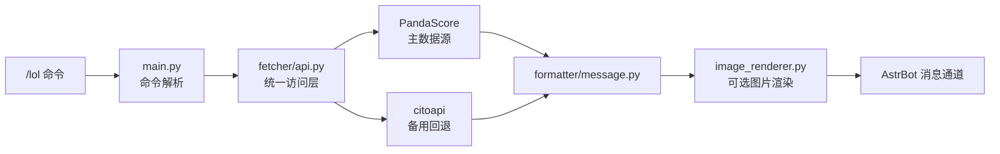

# 🎮 AstrBot LoL Notifier

LoL 电竞赛事推送与查询插件，覆盖主流赛区的赛程、实时比分、积分榜、战队与选手信息，并支持对局、系列赛、锦标赛、英雄/装备/符文/技能等查询。插件还集成了 B 站与微博内容抓取，支持按内容类型独立开关。

> 💡 **开箱即用** — 插件内置 API Key，安装后即可使用。
> 📡 数据来源：[PandaScore](https://pandascore.co)（主） + [citoapi](https://api.citoapi.com/api/v1/lol)（备用）

---

## 📦 安装

```bash
cd AstrBot/data/plugins
git clone https://github.com/MareDevi/astrbot_plugin_lol_notifier.git
```

依赖：
- [AstrBot](https://github.com/AstrBotDevs/AstrBot) >= v4
- `httpx`、`aiohttp`、`pillow`

---

## 📖 命令参考

所有命令以 `/lol` 开头，`[ ]` 表示可选参数，`< >` 表示必填参数。未指定赛区时默认使用 LPL。

### 🔹 lol matches — 比赛

> PandaScore: `GET /lol/matches` · `GET /lol/matches/running` · `GET /lol/matches/past` · `GET /lol/matches/upcoming` · `GET /lol/matches/{id}`

| 命令 | 说明 | 示例 |
|:--|:--|:--|
| `/lol schedule [赛区] [stage] [season]` | 查询赛区赛程，按距今天最近排序（默认 LPL，最近 5 场） | `/lol schedule lpl` |
| `/lol next [赛区] [stage] [season]` | 下一场未开赛的完整时间表 | `/lol next lck` |
| `/lol today [赛区]` | 今日所有赛程 | `/lol today` `/lol today lpl` |
| `/lol live [赛区]` | 正在进行的实时比赛（击杀/经济/塔/龙） | `/lol live` `/lol live lck` |
| `/lol result [赛区] [stage] [round]` | 比赛结果（默认最近一场） | `/lol result lpl` `/lol result lck playoff 3` |
| `/lol detail [赛区] [stage] [round]` | 比赛完整详情（含对局数据） | `/lol detail lck` |

### 🔹 lol games — 对局

> PandaScore: `GET /lol/games/{id}` · `GET /lol/games/{id}/events` · `GET /lol/games/{id}/frames` · `GET /lol/matches/{id}/games`

| 命令 | 说明 | 示例 |
|:--|:--|:--|
| `/lol game info <game_id>` | 单局详情 | `/lol game info 123456` |
| `/lol game events <game_id>` | 对局事件 | `/lol game events 123456` |
| `/lol game frames <game_id>` | 对局帧数据 | `/lol game frames 123456` |
| `/lol match games <match_id>` | 比赛所有对局 | `/lol match games 789012` |

### 🔹 lol stats — 统计数据

> PandaScore: `GET /lol/matches/{id}/players/stats` · `GET /lol/players/{id}/stats` · `GET /lol/teams/{id}/stats` · `GET /lol/series/{id}/teams/stats` · `GET /lol/tournaments/{id}/teams/{id}/stats`

| 命令 | 说明 | 示例 |
|:--|:--|:--|
| `/lol match stats <match_id>` | 比赛选手统计 | `/lol match stats 789012` |
| `/lol player stats <player_id>` | 选手统计 | `/lol player stats 456` |
| `/lol team stats <team_id>` | 战队统计 | `/lol team stats 123` |

### 🔹 lol teams — 战队

> PandaScore: `GET /lol/teams` · `GET /lol/series/{id}/teams`

| 命令 | 说明 | 示例 |
|:--|:--|:--|
| `/lol team info [战队名]` | 查看所有战队，或按名称筛选 | `/lol team info` `/lol team info T1` |

### 🔹 lol players — 选手

> PandaScore: `GET /lol/players`

| 命令 | 说明 | 示例 |
|:--|:--|:--|
| `/lol players [赛区]` | 选手列表 | `/lol players lck` |
| `/lol player <id>` | 选手信息 | `/lol player 456` |

### 🔹 lol series — 系列赛

> PandaScore: `GET /lol/series` · `GET /lol/series/past` · `GET /lol/series/running` · `GET /lol/series/upcoming`

| 命令 | 说明 | 示例 |
|:--|:--|:--|
| `/lol series [赛区] [status]` | 系列赛列表（status: past/running/upcoming） | `/lol series lck` `/lol series lck running` |
| `/lol series detail <id>` | 系列赛详情 | `/lol series detail 42` |

### 🔹 lol tournaments — 锦标赛

> PandaScore: `GET /lol/tournaments` · `GET /lol/tournaments/past` · `GET /lol/tournaments/running` · `GET /lol/tournaments/upcoming`

| 命令 | 说明 | 示例 |
|:--|:--|:--|
| `/lol tournaments [赛区] [status]` | 锦标赛列表 | `/lol tournaments lck` |
| `/lol tournament <id>` | 锦标赛详情 | `/lol tournament 15` |
| `/lol standings [赛区] [stage] [season]` | 积分榜 / 排名 | `/lol standings lck` `/lol standings lpl` |

### 🔹 lol champions — 英雄

> PandaScore: `GET /lol/champions` · `GET /lol/champions/{id}`

| 命令 | 说明 | 示例 |
|:--|:--|:--|
| `/lol champions [version]` | 英雄列表 | `/lol champions` `/lol champions 14.10` |
| `/lol champion <id_or_slug>` | 单个英雄 | `/lol champion Aatrox` |

### 🔹 lol items — 装备

> PandaScore: `GET /lol/items` · `GET /lol/items/{id}`

| 命令 | 说明 | 示例 |
|:--|:--|:--|
| `/lol items [version]` | 装备列表 | `/lol items` `/lol items 14.10` |
| `/lol item <id_or_slug>` | 单个装备 | `/lol item 1001` |

### 🔹 lol spells — 召唤师技能

> PandaScore: `GET /lol/spells` · `GET /lol/spells/{id}`

| 命令 | 说明 | 示例 |
|:--|:--|:--|
| `/lol spells` | 召唤师技能列表 | `/lol spells` |
| `/lol spell <id>` | 单个技能 | `/lol spell 1` |

### 🔹 lol runes — 符文

> PandaScore: `GET /lol/runes` · `GET /lol/runes/{id}` · `GET /lol/runes-reforged` · `GET /lol/runes-reforged/{id}` · `GET /lol/runes-reforged-paths` · `GET /lol/runes-reforged-paths/{id}`

| 命令 | 说明 | 示例 |
|:--|:--|:--|
| `/lol runes` | 符文列表（reforged） | `/lol runes` |
| `/lol rune <id>` | 单个符文详情 | `/lol rune 5001` |
| `/lol runes paths` | 符文系列表 | `/lol runes paths` |
| `/lol runes path <id>` | 单个符文系详情 | `/lol runes path 8100` |

### 🔹 lol masteries — 天赋

> PandaScore: `GET /lol/masteries` · `GET /lol/masteries/{id}`

| 命令 | 说明 | 示例 |
|:--|:--|:--|
| `/lol masteries` | 天赋列表 | `/lol masteries` |

### 🔹 lol leagues — 联赛

> PandaScore: `GET /lol/leagues`

| 命令 | 说明 | 示例 |
|:--|:--|:--|
| （联赛信息已内置在赛程/排名/战队等命令中） | | |

### 🔹 哔哩哔哩 / 微博

| 命令 | 说明 | 示例 |
|:--|:--|:--|
| `/lol bilibili` | 多账号 B 站综合动态（哔哩哔哩英雄联盟赛事、英雄联盟赛事、BLG电子竞技俱乐部） | `/lol bilibili` |
| `/lol weibo` | 英雄联盟赛事微博赛前海报最新 5 条 | `/lol weibo` |

### 🔹 订阅 & 管理

| 命令 | 说明 |
|:--|:--|
| `/lol subscribe` | 订阅自动推送（赛程 / B站 / 微博海报） |
| `/lol unsubscribe` | 取消当前会话的自动推送 |
| `/lol apikey` | 查看当前 API Key 状态 |
| `/lol apikey <新Key>` | 手动设置自定义 API Key（可选） |
| `/lol test [season]` | 运行连通性测试 |
| `/lol help` | 显示完整帮助 |

---

### 🌍 支持的赛区

插件默认覆盖主流 LoL 电竞赛区，例如 LCK / LPL / LEC / LCS / MSI / Worlds 等，命令中可直接使用缩写如 `lck`、`lpl`、`lec`。未指定赛区时默认使用 LPL。

> **stage** 参数可选 `regular`（常规赛，默认）或 `playoff`（季后赛）。
> **season** 参数可选 `current`（当前赛季，默认）或具体赛季 ID。

---

### 📡 内容来源集成

| 来源 | 账号 | 功能 | 触发方式 |
|:--|:--|:--|:--|
| 🔔 哔哩哔哩 | 哔哩哔哩英雄联盟赛事 (UID 50329118) | 视频 + 图文动态 + 直播推送 | 订阅自动 / `/lol bilibili` |
| 🔔 哔哩哔哩 | 英雄联盟赛事 (UID 108532523) | 视频 + 图文动态 + 直播推送 | 订阅自动 / `/lol bilibili` |
| 🔔 哔哩哔哩 | BLG电子竞技俱乐部 (UID 268999208) | 视频 + 图文动态 + 直播推送 | 订阅自动 / `/lol bilibili` |
| 📰 微博 | 英雄联盟赛事 (UID 6537214902) | LPL 赛前海报推送 | 订阅自动 / `/lol weibo` |

---

## ⚙️ 插件配置（可选）

以下配置在 AstrBot 插件管理面板中设置，均已有合理默认值，无需修改即可使用：

### 图片渲染

| 配置项 | 类型 | 默认值 | 说明 |
|:--|:--|:--|:--|
| `enable_image_render` | `bool` | `false` | 开启 HTML 图片渲染模式（需 Pillow） |

### API Key

插件内置 PandaScore 和 citoapi 的 API Key，开箱即用：

| 配置项 | 类型 | 默认值 | 说明 |
|:--|:--|:--|:--|
| `cito_api_key` | `string` | `""` | 自定义 citoapi Key。留空则使用内置 Key。也可设环境变量 `CITO_API_KEY` |

> PandaScore 的 API Key 已内置在代码中，无需额外配置。

### B站

3 个账号，每种内容类型独立开关：

| 账号 | UID | 默认推送 |
|:--|:--|:--|
| 哔哩哔哩英雄联盟赛事 | 50329118 | 视频 ✅ · 图文 ✅ · 直播 ❌ |
| 英雄联盟赛事 | 108532523 | 视频 ❌ · 图文 ✅ · 直播 ❌ |
| BLG电子竞技俱乐部 | 268999208 | 视频 ✅ · 图文 ✅ · 直播 ❌ |

| 配置项 | 类型 | 默认值 | 说明 |
|:--|:--|:--|:--|
| `bilibili_push_lol_video` | `bool` | `true` | 哔哩哔哩英雄联盟赛事 — 视频推送 |
| `bilibili_push_lol_article` | `bool` | `true` | 哔哩哔哩英雄联盟赛事 — 图文推送 |
| `bilibili_push_lol_live` | `bool` | `false` | 哔哩哔哩英雄联盟赛事 — 直播推送 |
| `bilibili_push_lolesports_video` | `bool` | `false` | 英雄联盟赛事 — 视频推送 |
| `bilibili_push_lolesports_article` | `bool` | `true` | 英雄联盟赛事 — 图文推送 |
| `bilibili_push_lolesports_live` | `bool` | `false` | 英雄联盟赛事 — 直播推送 |
| `bilibili_push_blg_video` | `bool` | `true` | BLG电子竞技俱乐部 — 视频推送 |
| `bilibili_push_blg_article` | `bool` | `true` | BLG电子竞技俱乐部 — 图文推送 |
| `bilibili_push_blg_live` | `bool` | `false` | BLG电子竞技俱乐部 — 直播推送 |

> B站 Cookie 已硬编码在 `bilibili.py` 中（`_DEFAULT_COOKIE`），也可通过环境变量 `BILIBILI_COOKIE` 覆盖。无需在 WebUI 中配置。

### 微博

| 配置项 | 类型 | 默认值 | 说明 |
|:--|:--|:--|:--|
| `weibo_uids` | `list` | `["6537214902"]` | 微博监控账号 UID 列表 |
| `enable_weibo_poster_push` | `bool` | `true` | 推送赛前海报 |
| `weibo_check_interval` | `int` | `300` | 微博检查间隔（秒） |

---

## 🏗 项目结构

```
astrbot_plugin_lol_notifier/
├── main.py                     # AstrBot 插件入口（16 条命令）
├── metadata.yaml               # 插件元数据
├── pyproject.toml              # 项目配置 & 依赖
├── _conf_schema.json           # 配置 Schema
├── README.md                   # 本文件
├── data/
│   ├── cmd_config.json         # 指令配置
│   ├── t2i_templates/          # HTML 渲染模板
│   └── temp/tool_images/
└── src/
    └── astrbot_plugin_lol_notifier/
        ├── __init__.py
        ├── config.py           # 配置管理
        ├── models.py           # 数据模型（dataclass）
        ├── image_renderer.py   # HTML → 图片渲染
        ├── scheduler.py        # 后台推送调度
        ├── state.py            # 推送去重状态管理
        ├── utils.py            # 工具函数
        ├── fetcher/            # 数据抓取层
        │   ├── __init__.py          # 导出 30+ 个 api 函数 + B站/微博抓取器
        │   ├── api.py               # 数据访问封装（PandaScore 优先 + citoapi 回退 + TTL 缓存）
        │   ├── pandascore.py        # PandaScore HTTP 客户端（主数据源，Bearer Token）
        │   ├── lolesports.py        # citoapi HTTP 客户端（备用数据源，x-api-key）
        │   ├── bilibili.py          # B站 API
        │   ├── bilibili_dynamic.py  # B站动态 API
        │   └── weibo.py             # 微博 API
        └── formatter/          # 格式化层（19 个活跃 formatter）
            ├── __init__.py
            └── message.py
```

### 数据流与架构

用户命令 `/lol ...` 会先由 `main.py` 解析并分发到数据访问层 `fetcher/api.py`；访问层会先走 PandaScore，必要时回退到 citoapi，并结合 TTL 缓存与统一结果封装。随后由 `formatter/message.py` 生成文本消息，必要时再由 `image_renderer.py` 输出图片。后台推送则由 `scheduler.py` 负责。



---

## 🧪 测试

项目已包含 pytest 测试用例，位于 [tests](./tests) 目录中。可直接运行：

```bash
pytest -q
```

---

## ⚠️ 当前状态与限制

插件以 PandaScore 为主数据源，citoapi 仅作为赛程、比分和积分榜等核心功能的备用回退。当前命令集整体可用，以下是简要状态说明：

| 类别 | 状态 | 说明 |
|:--|:--|:--|
| 赛程 / 实时 / 结果 / 积分榜 | ✅ 正常 | 主要由 PandaScore 提供，必要时回退到 citoapi |
| 对局事件 / 帧 / 选手统计 | ✅ 正常 | 依赖 PandaScore 的比赛与统计接口 |
| 战队 / 选手 / 系列赛 / 锦标赛 | ✅ 正常 | 支持按赛区和状态筛选 |
| 英雄 / 装备 / 符文 / 技能 | ✅ 正常 | 参考数据，仅依赖 PandaScore |
| B站 / 微博推送 | ✅ 正常 | 三个 B 站账号与微博海报独立开关 |

已知限制主要包括：
- PandaScore 存在请求频率限制，插件已通过速率控制和 TTL 缓存缓解。
- 非活跃赛季或休赛期时，部分 standings / stats 数据可能为空。
- `/lol live` 仅在有正在进行的官方比赛时才会有稳定返回。
- PandaScore 对部分非顶级联赛的选手与赛事覆盖可能不如主流联赛完整。
- 英雄、装备、符文和技能等参考数据目前仅依赖 PandaScore，没有备用源。

## 📝 License

MIT © [MareDevi](https://github.com/MareDevi)
