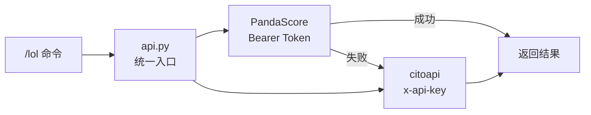

# 🎮 AstrBot LoL Notifier

LoL 电竞赛事推送与查询插件，覆盖 **LCK / LPL / LEC / LCS / MSI / Worlds** 等 14 个赛区，提供赛程、实时比分、积分榜、战队详情。同时集成哔哩哔哩英雄联盟赛事、英雄联盟赛事、BLG电子竞技俱乐部三个 B 站账号（视频·图文·直播）及英雄联盟赛事微博的赛前海报抓取，支持每种内容类型独立开关。

> 💡 **开箱即用** — 插件内置 API Key，安装后直接使用，无需额外配置。
> 📡 数据来源：[PandaScore](https://pandascore.co)（主） + [citoapi](https://api.citoapi.com/api/v1/lol)（备用）

### 🔄 数据流架构



| 功能 | 主数据源 | 回退 |
|:--|:--|:--|
| 赛程/下一场/今日 | PandaScore `GET /lol/matches` | citoapi |
| 实时比赛 `/lol live` | PandaScore `GET /lol/matches/running` ⚡ | citoapi |
| 比赛结果/详情 | PandaScore `GET /lol/matches/past` + `/{id}/games` | citoapi |
| 积分榜 `/lol standings` | PandaScore `GET /lol/tournaments/{id}/standings` | citoapi |
| 战队列表 `/lol team info` | PandaScore `GET /lol/teams` | citoapi |
| 单局详情 | PandaScore `GET /lol/games/{id}` | — |

---

## 📦 安装

```bash
cd AstrBot/data/plugins
git clone https://github.com/MareDevi/astrbot_plugin_lol_notifier.git
```

依赖：
- [AstrBot](https://github.com/AstrBotDevs/AstrBot) >= v4
- `httpx`、`aiohttp`、`pillow`

---

## 📖 命令参考

所有命令以 `/lol` 开头。`[ ]` 表示可选参数，`< >` 表示必填参数。**未指定赛区时默认使用 LPL**。

### 🔹 lol matches — 比赛

> PandaScore: `GET /lol/matches` · `GET /lol/matches/running` · `GET /lol/matches/past` · `GET /lol/matches/upcoming` · `GET /lol/matches/{id}`

| 命令 | 说明 | 示例 |
|:--|:--|:--|
| `/lol schedule [赛区] [stage] [season]` | 查询赛区赛程，按距今天最近排序（默认 LPL，最近 5 场） | `/lol schedule lpl` |
| `/lol next [赛区] [stage] [season]` | 下一场未开赛的完整时间表 | `/lol next lck` |
| `/lol today [赛区]` | 今日所有赛程 | `/lol today` `/lol today lpl` |
| `/lol live [赛区]` | 正在进行的实时比赛（击杀/经济/塔/龙） | `/lol live` `/lol live lck` |
| `/lol result [赛区] [stage] [round]` | 比赛结果（默认最近一场） | `/lol result lpl` `/lol result lck playoff 3` |
| `/lol detail [赛区] [stage] [round]` | 比赛完整详情（含对局数据） | `/lol detail lck` |

### 🔹 lol games — 对局

> PandaScore: `GET /lol/games/{id}` · `GET /lol/games/{id}/events` · `GET /lol/games/{id}/frames` · `GET /lol/matches/{id}/games`

| 命令 | 说明 | 示例 |
|:--|:--|:--|
| `/lol game info <game_id>` | 单局详情 | `/lol game info 123456` |
| `/lol game events <game_id>` | 对局事件 | `/lol game events 123456` |
| `/lol game frames <game_id>` | 对局帧数据 | `/lol game frames 123456` |
| `/lol match games <match_id>` | 比赛所有对局 | `/lol match games 789012` |

### 🔹 lol stats — 统计数据

> PandaScore: `GET /lol/matches/{id}/players/stats` · `GET /lol/players/{id}/stats` · `GET /lol/teams/{id}/stats` · `GET /lol/series/{id}/teams/stats` · `GET /lol/tournaments/{id}/teams/{id}/stats`

| 命令 | 说明 | 示例 |
|:--|:--|:--|
| `/lol match stats <match_id>` | 比赛选手统计 | `/lol match stats 789012` |
| `/lol player stats <player_id>` | 选手统计 | `/lol player stats 456` |
| `/lol team stats <team_id>` | 战队统计 | `/lol team stats 123` |

### 🔹 lol teams — 战队

> PandaScore: `GET /lol/teams` · `GET /lol/series/{id}/teams`

| 命令 | 说明 | 示例 |
|:--|:--|:--|
| `/lol team info [战队名]` | 查看所有战队，或按名称筛选 | `/lol team info` `/lol team info T1` |

### 🔹 lol players — 选手

> PandaScore: `GET /lol/players`

| 命令 | 说明 | 示例 |
|:--|:--|:--|
| `/lol players [赛区]` | 选手列表 | `/lol players lck` |
| `/lol player <id>` | 选手信息 | `/lol player 456` |

### 🔹 lol series — 系列赛

> PandaScore: `GET /lol/series` · `GET /lol/series/past` · `GET /lol/series/running` · `GET /lol/series/upcoming`

| 命令 | 说明 | 示例 |
|:--|:--|:--|
| `/lol series [赛区] [status]` | 系列赛列表（status: past/running/upcoming） | `/lol series lck` `/lol series lck running` |
| `/lol series detail <id>` | 系列赛详情 | `/lol series detail 42` |

### 🔹 lol tournaments — 锦标赛

> PandaScore: `GET /lol/tournaments` · `GET /lol/tournaments/past` · `GET /lol/tournaments/running` · `GET /lol/tournaments/upcoming`

| 命令 | 说明 | 示例 |
|:--|:--|:--|
| `/lol tournaments [赛区] [status]` | 锦标赛列表 | `/lol tournaments lck` |
| `/lol tournament <id>` | 锦标赛详情 | `/lol tournament 15` |
| `/lol standings [赛区] [stage] [season]` | 积分榜 / 排名 | `/lol standings lck` `/lol standings lpl` |

### 🔹 lol champions — 英雄

> PandaScore: `GET /lol/champions` · `GET /lol/champions/{id}`

| 命令 | 说明 | 示例 |
|:--|:--|:--|
| `/lol champions [version]` | 英雄列表 | `/lol champions` `/lol champions 14.10` |
| `/lol champion <id_or_slug>` | 单个英雄 | `/lol champion Aatrox` |

### 🔹 lol items — 装备

> PandaScore: `GET /lol/items` · `GET /lol/items/{id}`

| 命令 | 说明 | 示例 |
|:--|:--|:--|
| `/lol items [version]` | 装备列表 | `/lol items` `/lol items 14.10` |
| `/lol item <id_or_slug>` | 单个装备 | `/lol item 1001` |

### 🔹 lol spells — 召唤师技能

> PandaScore: `GET /lol/spells` · `GET /lol/spells/{id}`

| 命令 | 说明 | 示例 |
|:--|:--|:--|
| `/lol spells` | 召唤师技能列表 | `/lol spells` |
| `/lol spell <id>` | 单个技能 | `/lol spell 1` |

### 🔹 lol runes — 符文

> PandaScore: `GET /lol/runes` · `GET /lol/runes/{id}` · `GET /lol/runes-reforged` · `GET /lol/runes-reforged-paths`

| 命令 | 说明 | 示例 |
|:--|:--|:--|
| `/lol runes` | 符文列表 | `/lol runes` |
| `/lol runes paths` | 符文路径 | `/lol runes paths` |

### 🔹 lol masteries — 天赋

> PandaScore: `GET /lol/masteries` · `GET /lol/masteries/{id}`

| 命令 | 说明 | 示例 |
|:--|:--|:--|
| `/lol masteries` | 天赋列表 | `/lol masteries` |

### 🔹 lol leagues — 联赛

> PandaScore: `GET /lol/leagues`

| 命令 | 说明 | 示例 |
|:--|:--|:--|
| （联赛信息已内置在赛程/排名/战队等命令中） | | |

### 🔹 哔哩哔哩 / 微博

| 命令 | 说明 | 示例 |
|:--|:--|:--|
| `/lol bilibili` | 多账号 B 站综合动态（哔哩哔哩英雄联盟赛事、英雄联盟赛事、BLG电子竞技俱乐部） | `/lol bilibili` |
| `/lol weibo` | 英雄联盟赛事微博赛前海报最新 5 条 | `/lol weibo` |

### 🔹 订阅 & 管理

| 命令 | 说明 |
|:--|:--|
| `/lol subscribe` | 订阅自动推送（赛程 / B站 / 微博海报） |
| `/lol unsubscribe` | 取消当前会话的自动推送 |
| `/lol apikey` | 查看当前 API Key 状态 |
| `/lol apikey <新Key>` | 手动设置自定义 API Key（可选） |
| `/lol test [season]` | 运行连通性测试 |
| `/lol help` | 显示完整帮助 |

---

### 🌍 支持的赛区

| 命令缩写 | 赛区 | 联赛 Slug |
|:--|:--|:--|
| `lck` | LCK（韩国） | `lol-lck` |
| `lpl` | LPL（中国） | `lol-lpl` |
| `lec` | LEC（欧洲） | `lol-lec` |
| `lcs` | LCS（北美） | `lol-lcs` |
| `lco` | LCO（大洋洲） | `lol-lco` |
| `lcl` | LCL（独联体） | `lol-lcl` |
| `ljl` | LJL（日本） | `lol-ljl` |
| `pcs` | PCS（太平洋） | `lol-pcs` |
| `vcs` | VCS（越南） | `lol-vcs` |
| `cblol` | CBLOL（巴西） | `lol-cblol` |
| `lla` | LLA（拉丁美洲） | `lol-lla` |
| `tcl` | TCL（土耳其） | `lol-tcl` |
| `msi` | MSI 季中邀请赛 | `lol-msi` |
| `worlds` | 全球总决赛 | `lol-worlds` |

> **stage** 参数可选 `regular`（常规赛，默认）或 `playoff`（季后赛）。
> **season** 参数可选 `current`（当前赛季，默认）或具体赛季 ID。

---

### 📡 消息来源集成

| 来源 | 账号 | 功能 | 触发方式 |
|:--|:--|:--|:--|
| 🔔 哔哩哔哩 | 哔哩哔哩英雄联盟赛事 (UID 50329118) | 视频 + 图文动态 + 直播推送 | 订阅自动 / `/lol bilibili` |
| 🔔 哔哩哔哩 | 英雄联盟赛事 (UID 108532523) | 视频 + 图文动态 + 直播推送 | 订阅自动 / `/lol bilibili` |
| 🔔 哔哩哔哩 | BLG电子竞技俱乐部 (UID 268999208) | 视频 + 图文动态 + 直播推送 | 订阅自动 / `/lol bilibili` |
| 📰 微博 | 英雄联盟赛事 (UID 6537214902) | LPL 赛前海报推送 | 订阅自动 / `/lol weibo` |

---

## ⚙️ 插件配置（可选）

以下配置在 AstrBot 插件管理面板中设置，均已有合理默认值，无需修改即可使用：

### 图片渲染

| 配置项 | 类型 | 默认值 | 说明 |
|:--|:--|:--|:--|
| `enable_image_render` | `bool` | `false` | 开启 HTML 图片渲染模式（需 Pillow） |

### citoapi

| 配置项 | 类型 | 默认值 | 说明 |
|:--|:--|:--|:--|
| `cito_api_key` | `string` | `""` | 自定义 API Key。留空则使用内置 Key。也可设环境变量 `CITO_API_KEY` |

### B站

3 个账号，每种内容类型独立开关：

| 账号 | UID | 默认推送 |
|:--|:--|:--|
| 哔哩哔哩英雄联盟赛事 | 50329118 | 视频 ✅ · 图文 ✅ · 直播 ❌ |
| 英雄联盟赛事 | 108532523 | 视频 ❌ · 图文 ✅ · 直播 ❌ |
| BLG电子竞技俱乐部 | 268999208 | 视频 ✅ · 图文 ✅ · 直播 ❌ |

| 配置项 | 类型 | 默认值 | 说明 |
|:--|:--|:--|:--|
| `bilibili_push_lol_video` | `bool` | `true` | 哔哩哔哩英雄联盟赛事 — 视频推送 |
| `bilibili_push_lol_article` | `bool` | `true` | 哔哩哔哩英雄联盟赛事 — 图文推送 |
| `bilibili_push_lol_live` | `bool` | `false` | 哔哩哔哩英雄联盟赛事 — 直播推送 |
| `bilibili_push_lolesports_video` | `bool` | `false` | 英雄联盟赛事 — 视频推送 |
| `bilibili_push_lolesports_article` | `bool` | `true` | 英雄联盟赛事 — 图文推送 |
| `bilibili_push_lolesports_live` | `bool` | `false` | 英雄联盟赛事 — 直播推送 |
| `bilibili_push_blg_video` | `bool` | `true` | BLG电子竞技俱乐部 — 视频推送 |
| `bilibili_push_blg_article` | `bool` | `true` | BLG电子竞技俱乐部 — 图文推送 |
| `bilibili_push_blg_live` | `bool` | `false` | BLG电子竞技俱乐部 — 直播推送 |

> B站 Cookie 已硬编码在 `bilibili.py` 中（`_DEFAULT_COOKIE`），也可通过环境变量 `BILIBILI_COOKIE` 覆盖。无需在 WebUI 中配置。

### 微博

| 配置项 | 类型 | 默认值 | 说明 |
|:--|:--|:--|:--|
| `weibo_uids` | `list` | `["6537214902"]` | 微博监控账号 UID 列表 |
| `enable_weibo_poster_push` | `bool` | `true` | 推送赛前海报 |
| `weibo_check_interval` | `int` | `300` | 微博检查间隔（秒） |

---

## 🏗 项目结构

```
astrbot_plugin_lol_notifier/
├── main.py                     # AstrBot 插件入口（16 条命令）
├── metadata.yaml               # 插件元数据
├── pyproject.toml              # 项目配置 & 依赖
├── _conf_schema.json           # 配置 Schema
├── README.md                   # 本文件
├── TEST.md                     # 本地测试文档
├── data/
│   ├── cmd_config.json         # 指令配置
│   ├── t2i_templates/          # HTML 渲染模板
│   └── temp/tool_images/
└── src/
    └── astrbot_plugin_lol_notifier/
        ├── __init__.py
        ├── config.py           # 配置管理
        ├── models.py           # 数据模型（dataclass）
        ├── image_renderer.py   # HTML → 图片渲染
        ├── scheduler.py        # 后台推送调度
        ├── state.py            # 推送去重状态管理
        ├── utils.py            # 工具函数
        ├── fetcher/            # 数据抓取层
        │   ├── __init__.py          # 导出 18 个 api 函数 + B站/微博抓取器
        │   ├── api.py               # 数据访问封装（40+ 端点 + TTL 缓存）
        │   ├── lolesports.py        # citoapi HTTP 网络层（30 个官方端点）
        │   ├── bilibili.py          # B站 API
        │   ├── bilibili_dynamic.py  # B站动态 API
        │   └── weibo.py             # 微博 API
        └── formatter/          # 格式化层（19 个活跃 formatter）
            ├── __init__.py
            └── message.py
```

### 数据流

```
用户命令 (/lol xxx)
    ↓
main.py → LoLNotifierPlugin（命令解析 & 路由）
    ↓
fetcher/api.py → 数据访问层（league 校验 + TTL 缓存 + Result 封装）
    ↓
fetcher/lolesports.py → citoapi HTTP 请求（_request + 速率限制 + 指数退避）
    ↓
citoapi (https://api.citoapi.com/api/v1)
    ↓
formatter/message.py → 格式化输出（文本 / 图片）
    ↓
image_renderer.py → HTML 模板渲染（可选图片模式）
    ↓
AstrBot 消息通道（QQ / Telegram / WebChat）
```

### 架构分层

| 层 | 职责 | 关键模块 |
|:--|:--|:--|
| **命令层** | 解析用户指令，参数校验，结果分发 | `main.py` |
| **数据访问层** | TTL 缓存、league 校验、Result 模式封装 | `fetcher/api.py` |
| **网络层** | HTTP 请求、速率限制（6s）、指数退避（429） | `fetcher/lolesports.py` |
| **格式化层** | 19 个 formatter 将数据转为可读消息 | `formatter/message.py` |
| **渲染层** | HTML 模板 → Pillow 图片渲染 | `image_renderer.py` |
| **调度层** | 定时推送赛程/B站/微博更新 | `scheduler.py` |

---

## 🧪 测试

详见 [TEST.md](./TEST.md)，包含全端点连通性测试、按类别逐类测试、Python 脚本测试、命令清单及错误处理验证。

---

## ⚠️ 已知限制 (Known Limitations)

以下功能依赖 citoapi 的特定端点，可能因 API 覆盖范围或不支持而返回空数据：

| 功能 | 状态 | 说明 |
|:--|:--|:--|
| 赛程查询 (schedule/next/today/week) | ✅ 正常 | 覆盖 LCK/LPL 等主要赛区，支持无赛程时自动跨赛区回退 |
| 实时比赛 (live) | ✅ 正常 | 需要比赛正在进行中，支持实时系列赛+视觉状态 |
| 比赛结果/详情 (result/detail/bp) | ✅ 正常 | 自动获取详细对局数据，无比赛时回退到基础信息 |
| 比赛覆盖率 (coverage) | ✅ 正常 | `/lol coverage [赛区]` 查询 API 覆盖的比赛范围 |
| 积分榜 (standings) | ✅ 正常 | 赛季进行中数据更完整 |
| 对局数据 (plates/distributions/vision/jungle) | ✅ 正常 | 装备购买/伤害分布/视野得分/打野占比 |
| 战队信息/阵容 (team info) | ✅ 正常 | 支持名称直接匹配 |
| 战队搜索 (team search) | ⚠️ 部分 | 搜索 API 可能不稳定，支持直接名称回退 |
| 战队交手记录 (team h2h) | ⚠️ 部分 | API 数据可能为空 |
| 选手搜索/信息 (player search/info) | ⚠️ 部分 | 依赖 API 选手数据库覆盖 |
| 选手奖金 (player earnings) | ✅ 正常 | 查询选手生涯奖金汇总 |
| 转会详情 (transfers player/team) | ✅ 正常 | 支持按选手或战队查询转会历史 |
| 世界赛查询 (tournament *) | ⚠️ 部分 | `/lol/tournaments/*` 端点可能在 citoapi 中不可用 |
| 英雄统计 (champion stats) | ⚠️ 部分 | `/lol/champions/stats` 端点可能返回空数据 |
| 英雄 Pick/Ban 率 (champion presence) | ⚠️ 部分 | 同上 |
| 全球战力排名 (ranking gpr) | ⚠️ 部分 | `/lol/rankings/gpr` 端点可能不可用 |
| 热门趋势 (trending) | ⚠️ 部分 | 取决于 API 数据更新频率 |
| 历史赛事 (history) | ⚠️ 部分 | 数据可能不完整或有格式差异 |
| 转会信息 (transfers) | ⚠️ 部分 | 字段名可能与 API 返回不完全匹配 |
| 赛事记录 (records) | ⚠️ 部分 | 同上 |

> 💡 标记为 ⚠️ 的功能取决于 citoapi 的数据覆盖。如果 API 返回空数据，插件会显示相应的提示信息。建议优先使用标记为 ✅ 的稳定功能。

---

## � 功能状态

### 赛程 & 比赛

| 命令 | 状态 | 备注 |
|:--|:--|:--|
| `lol schedule` | ✅ 正常 | 完整赛程查询 |
| `lol next` | ✅ 正常 | 自动区分过去/未来比赛 |
| `lol today` | ✅ 正常 | 今日赛程 |
| `lol week` | ✅ 正常 | 本周赛程 |
| `lol live` | ✅ 正常 | 实时比赛需赛事进行中 |
| `lol result` | ✅ 正常 | 支持 `round` 或 `match_id` 匹配 |
| `lol bp` | ✅ 正常 | 需比赛已完成且 API 有 BP 数据 |
| `lol detail` | ✅ 正常 | 需比赛已完成且有详情 |
| `lol standings` | ✅ 正常 | 多路径数据提取 |

### 战队 (`/lol team`)

| 子命令 | 状态 | 备注 |
|:--|:--|:--|
| `search` | ✅ 正常 | 建议使用英文名，大小写敏感 |
| `info` | ⚠️ 部分 | API 数据覆盖取决于 citoapi |
| `roster` | ✅ 正常 | 修复：角色排序+多字段名匹配 |
| `matches` | ✅ 正常 | 近期比赛记录 |
| `stats` | ✅ 正常 | 赛季统计 |
| `h2h` | ✅ 正常 | 历史交手记录 |

### 选手 (`/lol player`)

| 子命令 | 状态 | 备注 |
|:--|:--|:--|
| `search` | ✅ 正常 | 建议使用英文 ID（如 Faker），大小写敏感 |
| `info` | ⚠️ 部分 | API 数据覆盖取决于 citoapi |
| `stats` | ✅ 正常 | 赛季统计数据 |
| `champions` | ✅ 正常 | 英雄池与使用率 |

### 锦标赛 (`/lol tournament`)

| 子命令 | 状态 | 备注 |
|:--|:--|:--|
| `info` | ✅ 正常 | 已修复：slug 解析+回退 |
| `standings` | ✅ 正常 | slug 回退支持 |
| `bracket` | ✅ 正常 | 淘汰赛对阵图 |
| `mvp` | ✅ 正常 | slug 回退支持 |

### 英雄 & 排行

| 命令 | 状态 | 备注 |
|:--|:--|:--|
| `lol champion stats` | ⚠️ 部分 | 需要对应赛区赛季有数据 |
| `lol champion presence` | ⚠️ 部分 | 仅在活跃赛季有数据 |
| `lol ranking gpr` | ⚠️ 部分 | 依赖 API 是否已发布该期 GPR |
| `lol ranking players` | ✅ 正常 | 选手数据排名 |
| `lol leaderboard` | ✅ 正常 | 赛区内排行榜 |

### 其他查询

| 命令 | 状态 | 备注 |
|:--|:--|:--|
| `lol trending` | ✅ 正常 | 修复：显示具体内容而非仅计数 |
| `lol history` | ⚠️ 部分 | 已增强字段匹配；数据质量取决于 API |
| `lol transfers` | ⚠️ 部分 | 已增强多字段名匹配；数据质量取决于 API |
| `lol records` | ⚠️ 部分 | 历史记录依赖于 API 覆盖 |

### 已知局限性

- **搜索大小写敏感**：`/lol player search Faker` 必须大小写完全匹配 API 中的记录
- **非活跃赛季**：休赛期 standings/stats/champion 可能返回空数据
- **实时数据**：`/lol live` 仅在有正在进行的官方比赛时可获取
- **API 覆盖**：citoapi 对部分赛区/赛季/锦标赛的数据覆盖可能不完整
- **转会数据**：API 返回的数据字段名可能不一致，虽然增加了多字段匹配，部分条目仍可能显示为空

## �📝 License

MIT © [MareDevi](https://github.com/MareDevi)
